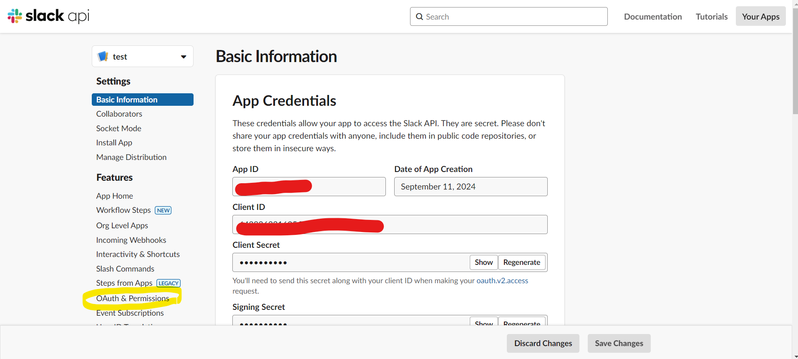

# Google Drive Clone

## 目次

- [Google Drive Clone](#google-drive-clone)
  - [目次](#目次)
  - [プロジェクト概要](#プロジェクト概要)
  - [ディレクトリ構造](#ディレクトリ構造)
  - [使い方](#使い方)
    - [STEP1：`Secrets`下のファイルに情報を入力する。](#step1secrets下のファイルに情報を入力する)
      - [1. `/secrets/CLIENT_SECRET.json`の設定](#1-secretsclient_secretjsonの設定)
      - [2. `/secrets/DRIVE_INFO.json`の設定](#2-secretsdrive_infojsonの設定)
      - [3. `/secrets/LOCAL_INFO.json`の設定](#3-secretslocal_infojsonの設定)
      - [4. `/secrets/SLACK_CONFIG.json`の設定](#4-secretsslack_configjsonの設定)
      - [補足1：Google OAuth2 Clientの設定](#補足1google-oauth2-clientの設定)
      - [補足2：Slack APIの設定](#補足2slack-apiの設定)
    - [STEP2：`setup.sh`を実行する。](#step2setupshを実行する)
    - [STEP3：`clone_to_GD.sh`を実行する。](#step3clone_to_gdshを実行する)

## プロジェクト概要

* 使用言語：shellscript
* スケジューリング：cron
* 目的：指定したローカルディレクトリをGDのtargetフォルダにクローンする。

## ディレクトリ構造

<details><summary>ディレクトリ構造</summary>

```shellscript
.
├── clone_to_GD.sh (実行ファイル)
├── setup.sh (セットアップ実行ファイル)
├── README.md
├── doc
│   └── pic
│       └── *.png
├── lib
│   ├── compare_trees.sh
│   ├── create_GD_file.sh
│   ├── delete_GD_file.sh
│   ├── get_GD_folder_contents.sh
│   ├── get_access_token.sh
│   ├── get_refresh_token.sh
│   ├── log_utils.sh
│   ├── slack_utils.sh
│   ├── tree_GD.sh
│   ├── tree_ROOT.sh
│   └── update_GD_file.sh
├── secrets
│   ├── ACCESS_TOKEN.json
│   ├── DRIVE_INFO.json
│   ├── LOCAL_INFO.json
│   ├── REFRESH_TOKEN.json
│   ├── SLACK_CONFIG.json
│   └── CLIENT_SECRET.json
├── log
│   └── *.log
└── temp
    └── *
```

</details>

## 使い方

* STEP1：`Secrets`下のファイルに情報を入力する。
* (補足1：Google OAuth2 Clientの設定。)
* (補足2：Slack APIの設定。)
* STEP2：`setup.sh`を実行する。
* STEP3：`clone_to_GD.sh`を実行する。

### STEP1：`Secrets`下のファイルに情報を入力する。

<details><summary>`Secrets`下のファイルに情報を入力する。</summary>

#### 1. `/secrets/CLIENT_SECRET.json`の設定

GCPでOAuthのClientを作成し，情報を`/secrets/CLIENT_SECRET.json`に記入します。以下はJSONの例です：

```json
{
    "client_id":"...",
    "project_id":"...",
    "auth_uri":"...",
    "token_uri":"https://oauth2.googleapis.com/token",
    "auth_provider_x509_cert_url":"https://www.googleapis.com/oauth2/v1/certs",
    "client_secret":"...",
    "redirect_uris":["..."]
}
```

#### 2. `/secrets/DRIVE_INFO.json`の設定

Google DriveのtargetフォルダのIDを記入します：

```json
{
    "target": "folder_id"
}
```

フォルダIDは，フォルダのURLの`https://drive.google.com/drive/folders/1U2a7_KXntuuODiCxBx_XRNBM0wyU_Fr9`のうち`1U2a7_KXntuuODiCxBx_XRNBM0wyU_Fr9`部分です。

#### 3. `/secrets/LOCAL_INFO.json`の設定

ローカルのtargetフォルダの絶対パスを記入します：

```json
{
    "target": "絶対パス"
}
```

#### 4. `/secrets/SLACK_CONFIG.json`の設定

Slack通知用の設定を記入します：

```json
{
    "channel": "チャンネル名",
    "token": "Slackボットトークン"
}
```

</details>

#### 補足1：Google OAuth2 Clientの設定

<details><summary>Google OAuth2 Clientの設定</summary>

1. [GCPコンソール](https://console.cloud.google.com/welcome/new?hl=ja)から，ツールバー>APIとサービス>認証情報に移動します。

   

2. 認証情報を作成 > OAuth クライアント IDを選択します。

   

3. ウェブアプリケーションを選択します。

   

4. 名前を記入し，承認済みのリダイレクト URIには「http://localhost」を記入します。

   

5. クライアントの情報をJSON形式でダウンロードします。

   

6. ダウンロードしたJSONファイルから必要な情報を`/secrets/CLIENT_SECRET.json`に記入します。

</details>

#### 補足2：Slack APIの設定

<details><summary>Slack APIの設定</summary>

Slack APIを設定し、エラー通知を受け取るためには以下の手順に従ってください：

1. [Slack API](https://api.slack.com/apps)にアクセスし，ログインします。
   

2. 右上の「Your Apps」をクリックし、「Create New App」ボタンをクリックします。
   

3. 「From scratch」を選択します。
   

4. アプリ名を入力し（例：「error notification」）、ワークスペースを選択して「Create App」をクリックします。
   

5. アプリの基本情報ページに移動したら、左サイドバーの「OAuth & Permissions」をクリックします。
   

6. 「Scopes」セクションまでスクロールダウンし、「Bot Token Scopes」に以下の権限を追加します：`chat:write`
   

7. ページ上部の「Install to Workspace」ボタンをクリックします。
   

8. 確認画面が表示されたら、「Allow」をクリックします。
   

9. インストール後、「Bot User OAuth Token」が表示されます。このトークンをコピーします。
   

10. `/secrets/SLACK_CONFIG.json`ファイルを作成し、以下の形式で内容を記入します：

    ```json
    {
        "channel": "エラー通知を送信するチャンネル名",
        "token": "xoxb-で始まるBot User OAuth Token"
    }
    ```

11. Slackワークスペースで、エラー通知を受け取るための新しいチャンネルを作成します（例：`#error_notification_test`）。チャンネルのメンバーを開きます。
    

12. 「Integrations」タブを選択し，「Apps」セクションで「Add apps」をクリックします。。
    

13. 表示されたアプリ一覧から、先ほど作成した「error notification」アプリ（または自分で付けた名前）を探し、「Add」ボタンをクリックします。
    

14. アプリがチャンネルに追加されたことを確認します。

アプリが追加されると，以下のような通知がSlackチャンネルに送信されます：


エラー通知の例：


この設定により、プログラムで発生したエラーをリアルタイムでSlackチャンネルに通知することができ、迅速な対応が可能になります。

</details>

### STEP2：`setup.sh`を実行する。

<details><summary>`setup.sh`を実行する。</summary>

1. プロジェクトディレクトリに移動します：

   ```shellscript
   cd path/to/clone_to_GD
   ```

2. `setup.sh`に実行権限を付与し，実行します：

   ```shellscript
   chmod +x setup.sh
   ./setup.sh
   ```

3. 実行すると，URLが表示されます。

   

4. このURLをブラウザで開きます。アカウントの選択を求められるので，GCPのアカウントを選択します。

   

5. 警告が表示されますが，そのまま続行します。

   

6. 認証が成功すると，以下のような画面が表示されます。

   

7. URLの中の`code=...`の部分をコピーし，`setup.sh`に入力します。

   

8. 成功すると，`/secrets/REFRESH_TOKEN.json`に以下のようなJSON形式でトークンが保存されます：

   ```json
   {
     "access_token": "....",
     "expires_in": 3599,
     "refresh_token": ".....",
     "scope": "https://www.googleapis.com/auth/drive",
     "token_type": "Bearer"
   }
   ```

   `refresh_token`のキーが値を持っていれば成功です。

</details>

### STEP3：`clone_to_GD.sh`を実行する。

<details><summary>`clone_to_GD.sh`を実行する。</summary>

以下のコマンドで実行します：

```shellscript
./clone_to_GD.sh
```

`/secrets/LOCAL_INFO.json`と`/secrets/DRIVE_INFO.json`の情報を変更することで，クローン元とクローン先を変更できます。

</details>
